# DiVenn

**DiVenn** is an interactive and integrated web-based tool for comparing gene lists

## Resources

- [API Reference](https://github.com/BCH-RC/DiVenn2_Ardigen/blob/main/API.md)
- [Client's README](https://github.com/BCH-RC/DiVenn/blob/master/README.md)

## Introduction

Gene expression data generated from multiple biological states (mutant sample, double mutant sample and wild-type samples) are often compared via Venn diagram tools. It is of great interest to know the expression pattern between overlapping genes and their associated gene pathways or gene ontology terms. We developed DiVenn – a novel web-based tool that compares gene lists from multiple RNA-Seq experiments in a force directed graph, which shows the gene regulation levels for each gene and integrated KEGG pathway and gene ontology (GO) knowledge for the data visualization. Divenn2 includes exciting new features:
 - Expanded the number of species that can now be supported for gene analysis (now 23 species in total), including less-model species.
 - Support for a new ID type: Ensembl IDs. NCBI/Entrez, Uniprot, and Ensembl IDs are now supported depending on the target organism
 - Increased number of experiments allowed for visualization to 10 total experiments
 - More color and shape options for visualizations
 - Font size options
 - Pathway details and KEGG pathway enrichment details tables
 - Gene ontology details and GO enrichment details tables
 - Right-click options for each gene group to generate gene group details tables
 - Single gene detail tables
 - An updated database to include new species and provide mapping to other ID types if necessary/available (see Figure 17)
 - Generation of tables and bar chart visualizations for GO enrichment and KEGG enrichment analysis (See Figures 13, 14, 15, & 16)
 

### DiVenn has three key features:

- Informative force-directed graph with gene expression levels to compare multiple data sets;
- Interactive visualization with biological annotations and integrated pathway and GO databases, which can be used to subset or highlight gene nodes to pathway or GO terms of interest in the graph;
- High resolution image and gene-associated information export.

_The current version is “2.0”._

The application is freely available at https://divenn.tch.harvard.edu/ (see Figure 1).

# Citation
Sun, Liang, et al. 
["DiVenn: An Interactive and Integrated Web-based Visualization Tool for Comparing Gene Lists."](https://www.frontiersin.org/articles/10.3389/fgene.2019.00421/abstract) Frontiers in Genetics (2019),doi: 10.3389/fgene.2019.00421 
##### REPLACE with new article

# Authors
- Liang Sun: sunliang@udel.edu
- Dane Zeeb: dane.zeeb@childrens.harvard.edu
- Yinbing Ge: yinge@noble.org
- Zach Robinson: ztrobinson@noble.org
- Xueqiong Li: xli@noble.org
# Contact Us
If you have any questions, please contact Liang Sun: sunliang@udel.edu
# Tutorial
> **[Version 1.0](http://divenn.noble.org/v1/)**

Click below to watch a tutorial video.

The application is freely available at https://divenn.tch.harvard.edu/  (see Figure 1). 

 
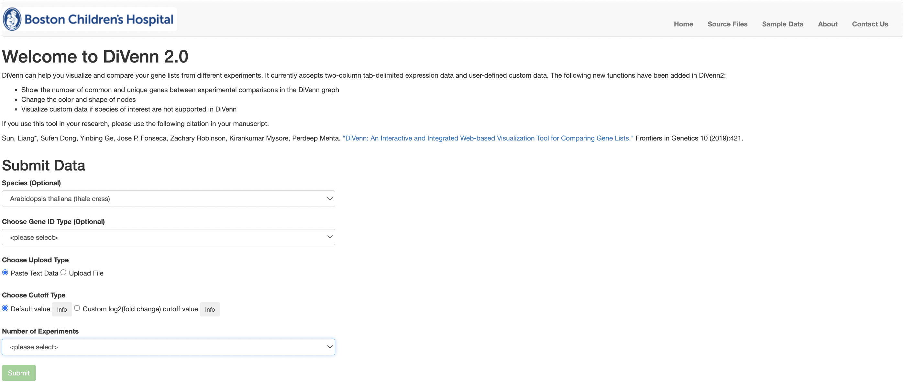
 _**Figure 1.** Homepage of DiVenn_

## Browser requirements
All modern browsers, such as Safari, Google Chrome, and IE are supported. The recommended web browser is [Chrome](https://www.google.com/chrome/). 

## Introduction of DiVenn Interface
### 1.   Input Data

DiVenn currently accepts two types of input data (see Figure 2): 
1. Two-column tab separated custom data. For example, gene ID and corresponding pathway data, transcription factors and their regulated downstream genes, and microRNAs and corresponding target genes. The second column must be "1" or "2". 
2. Gene expression data. The first column is gene IDs and the second column is gene regulation value. The gene regulation value should be obtained from differentially expressed (DE) genes. Users can select the cut-off value of fold change (for example, two-fold change) to define their DE genes. To simplify this gene regulation value, we require users to use “1” to represent up-regulated genes and “2” to represent down-regulated genes based on their own cut-off value of fold change. If users need to link their genes to the KEGG pathway (Kanehisa and Goto, 2000) or GO database, 14 model species are supported in DiVenn. Currently, three types of gene IDs : KEGG, Uniprot (UniProt, 2008) and NCBI (Benson, et al., 2018), are accepted for pathway analysis. All agriGO (Du, et al., 2010; Tian, et al., 2017) supported IDs are supported for GO analysis by DiVenn ([View table](image/tutorial/GO_table.md) or download in [Excel](image/tutorial/GO_version.xlsx)).

Please use the following sample data to test our tool: https://divenn.tch.harvard.edu/data.php ##### UPDATE THIS

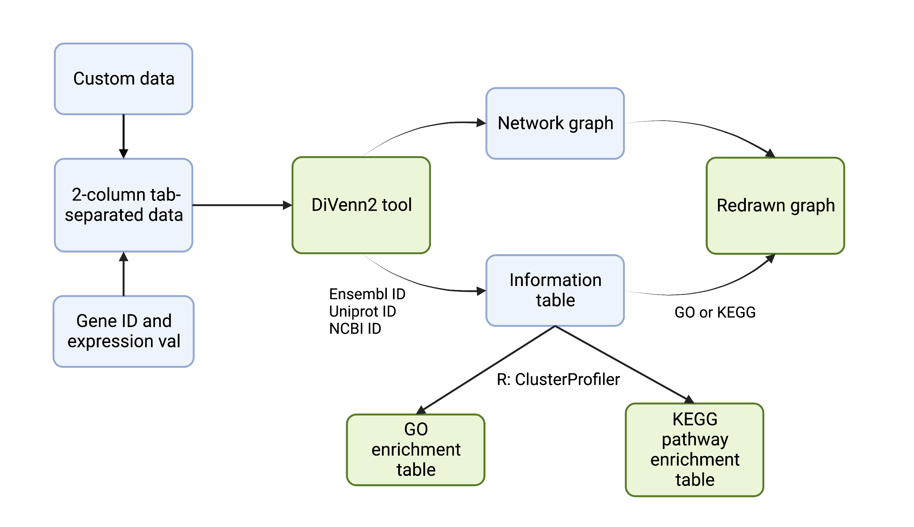

_**Figure 2.** Flow chart of DiVenn_

### 2.   Visualization
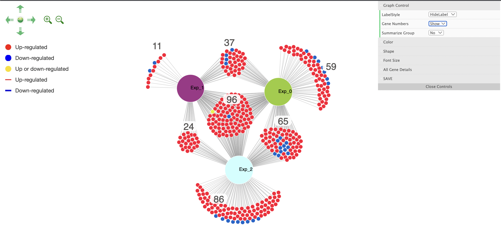

 _**Figure 3.** Force-directed graph in DiVenn_

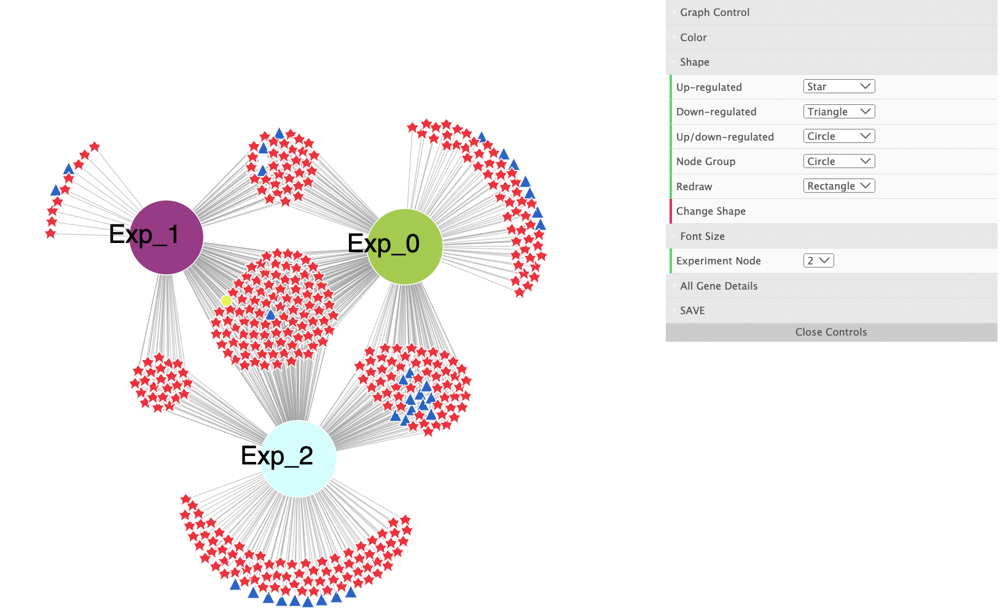
_**Figure 4.** Change shapes and font size_

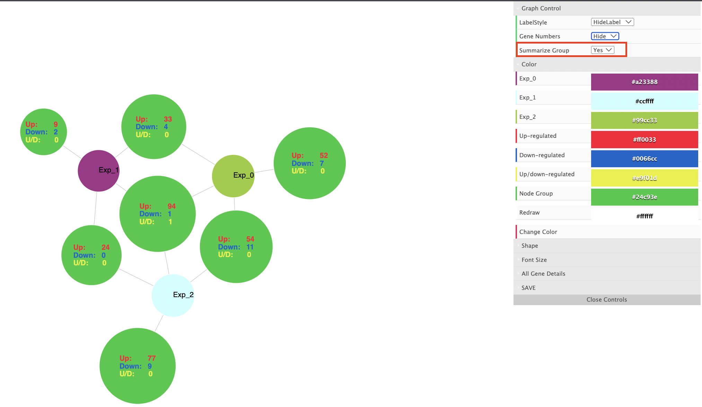
_**Figure 5.** Change color scheme and summarize groups_

### 3.	Click on the Graph
Scrolling with the mouse wheel on the graph will zoom into/out of the graph.

Left-clicking a node will show the connected edge colors, which will display the gene regulation status for each experiment. Double-clicking the same node will hide the connecting edge colors.

Right-clicking a node will show five function options: show or hide one or all node labels, show all gene associated pathways, or GO terms.

#### 3.1	Show and hide node label function
Right-clicking nodes can show the gene IDs of interest (see Figure 6).

#### 3.2	Link to KEGG pathway and GO terms
If users need to check the KEGG pathway or GO terms of interested gene node, they can choose the ‘Gene details’ option after right clicking the node (see Figure 7). Users may also see the KEGG pathway and GO terms of all genes in a given group of gene nodes by selecting 'Gene group details' after right clicking any node in a group (see Figure 6 and Figure #).

 
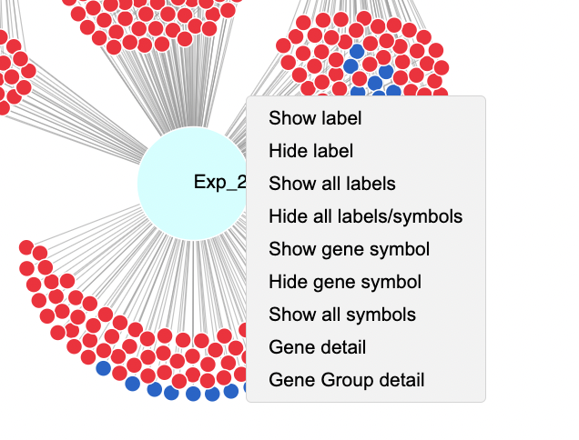

_**Figure 6.** Right-click functions. Gene node names can be displayed and hidden; the detailed gene function, including pathway and GO terms, can be displayed through ‘Gene details’ button. A list of GO terms, pathways, and alternate IDs for each gene in a group of nodes can be displayed through the "Gene group details" button. Additionally, GO enrichment and KEGG pathway enrichment can be performed from the Gene group details table (see Figure #)._

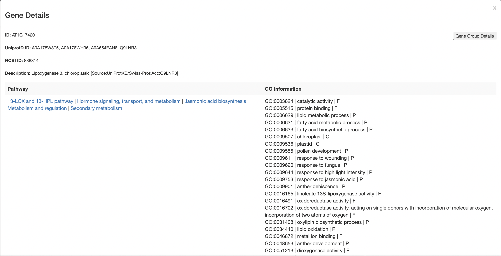

_**Figure 7.** Gene details. KEGG pathway and GO terms will be displayed._

### 4.	GUI Function

#### Label Style
You can hide or show node labels. 

#### Color
You can change the color of all parent/experiment nodes in GUI (see Figure 5).

#### Save
Graph can be saved as an SVG image file via the "Save as SVG" function, and the SVG file can be downloaded to your local computer. This SVG file can be converted to a high-resolution image using free online tools.

#### Show Pathway Detail
You can show all gene-associated pathways by clicking this button to get the pathway information table (see Figure 8).

The column headers on the informative table are sortable; the table is also searchable with key words of interest. If users need to sort a gene list based on the pathway name, they can click on the “Pathway” column header. If users need to select multiple genes from the same pathway after sorting the genes based on pathway, they can click the first checkbox and press shift before clicking the last checkbox. They can redraw the selected genes to the square shapes by clicking the “Redraw” button at the end of the table or subset the genes into another new graph by clicking the “Only Redraw Selected” checkbox and the “Redraw” button. For example, we can select all genes which are enriched to a significant KEGG pathway “Plant-pathogen interaction” (p value = 7.83e-14) and highlight all genes to be square shapes via “Redraw” function (See Figure 8). We can also subset all genes which belong to KEGG pathway “Plant-pathogen interaction” into another new graph (See Figure 10).
 

 
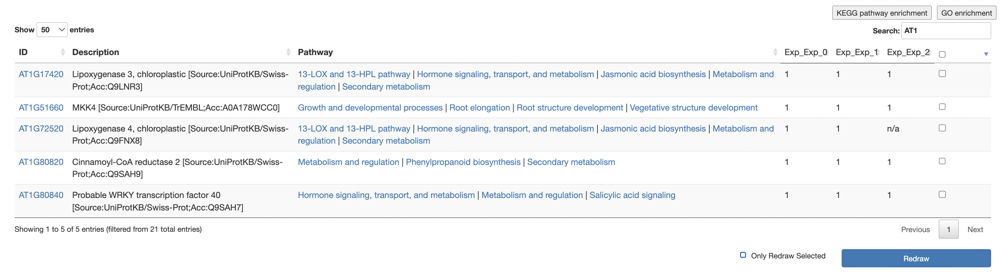
_**Figure 8.** Pathway details of all associated genes in the force-directed graph._

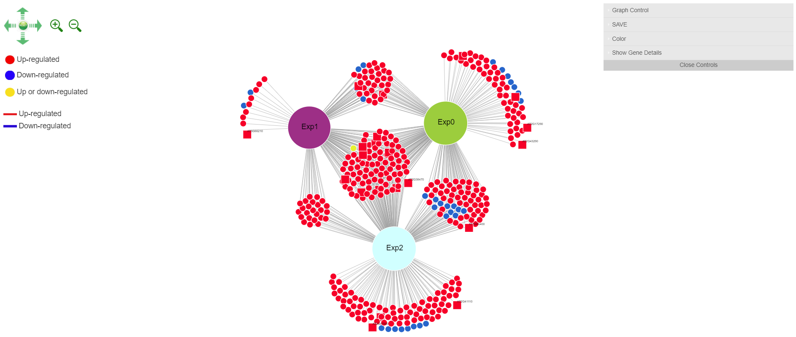
_**Figure 9.** Highlight of genes in KEGG Plant-pathogen interaction pathway (square node)._

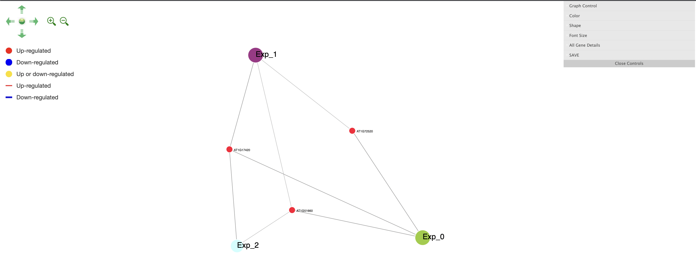
_**Figure 10.** Subset of genes belonging to KEGG Plant-pathogen interaction pathway._

#### Show Gene Ontology Detail
You can show all gene-associated gene ontologies by clicking this button to get the gene ontology informative table (see Figure 11).

The column headers on the informative table are sortable; the table is also searchable with key words of interest. If you need to sort the gene list based on the gene ontology name, click on the “GO term” column header. If you need to select multiple genes from the same GO terms after sorting the genes based on GO terms, click the first checkbox and press shift before clicking the last checkbox. You can redraw the selected genes to the square shapes by clicking the “Redraw” button at the end of the table or subset the genes into another new graph by clicking the “Only Redraw Selected” checkbox and the “Redraw” button.

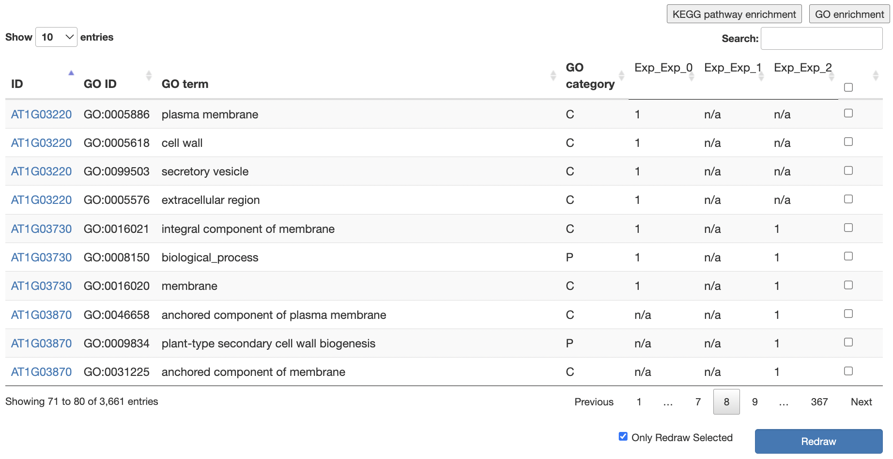
_**Figure 11.** Gene ontology details of all associated genes in the force-directed graph._

#### Show Gene Group Details
Detailed information for a group of genes can be obtained by right-clicking a node within a group of nodes in the graph and selecting "Gene Group Details". 

The resulting table includes rows for each gene in the group with information such as its ID and any other mapped IDs (if available), gene description, pathway(s) that each gene is involved in with KEGG URLs, and GO information in the format: GO ID, GO description, GO category. The gene group details table also includes a button to export a txt file of the current table, and buttons to perform GO and KEGG pathway enrichment analysis (Figures 13-16).

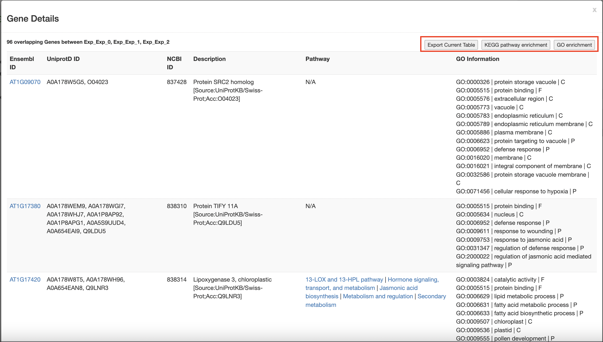
_**Figure 12.** Table generated when clicking on a node -> show gene group details._

#### Show GO Enrichment Analysis Table and Bar Plot Visualizations
You can perform GO enrichment analysis for all genes after generating the pathway or GO tables, or for groups of genes by generating the gene group detail table and pressing the corresponding buttons. 

GO enrichment analysis is performed after mapping the list of genes to relevant IDs if necessary (see Figure 17). A table is generated providing detailed information for each enriched GO ID, including gene ratio, adjusted p val., q val., and more. All of the output of the GO enrichment analysis can be viewed via the "All" tab, or by category in each corresponding tab. Additionally, bar chart visualizations of the top 20 GO IDs are created for all and per category. You can also change the color of the visualizations using 4 color schemes in the drop down menu (Figure 13 and Figure 14).

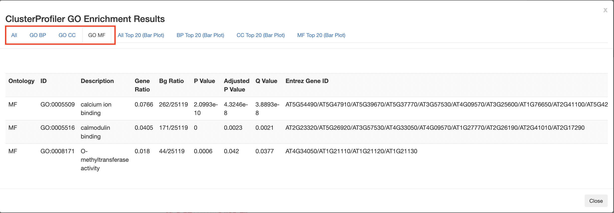
_**Figure 13.** GO enrichment results table with separate tabs for all, BP, CC, MF, and corresponding bar plot visualizations._

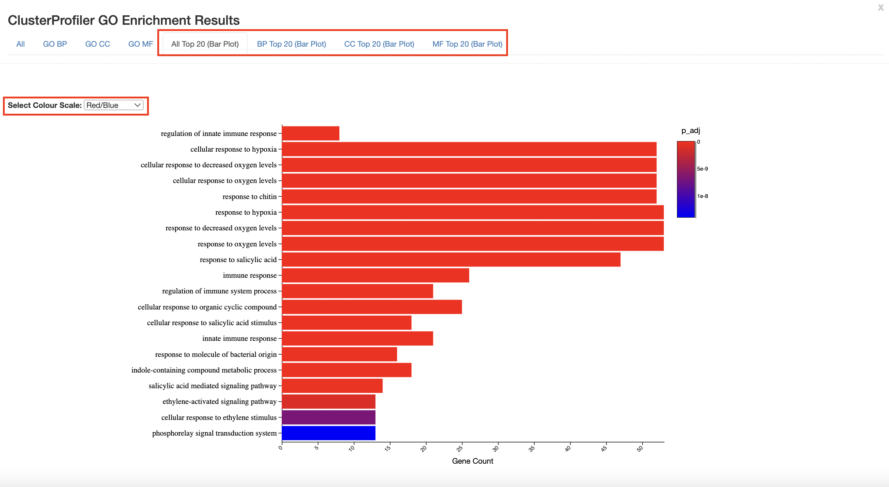
_**Figure 14.** GO enrichment bar plot visualizations created from GO enrichment results._

#### Show KEGG Pathway Enrichment Analysis Table
You can perform KEGG pathway enrichment analysis for all genes after generating the pathway or GO tables, or for groups of genes by generating the gene group detail table and pressing the corresponding buttons. 

KEGG pathway enrichment analysis is performed after mapping the list of genes to relevant IDs if necessary (see Figure 17). A table is generated providing detailed information for each enriched pathway, including gene ratio, adjusted p val., q val., and more. All of the output of the KEGG pathway enrichment analysis can be viewed via the "KEGG Pathways" tab. Additionally, a bar chart visualization of the top 20 pathways is created. You can also change the color of the visualizations using 4 color schemes in the drop down menu (Figure 15 and Figure 16).

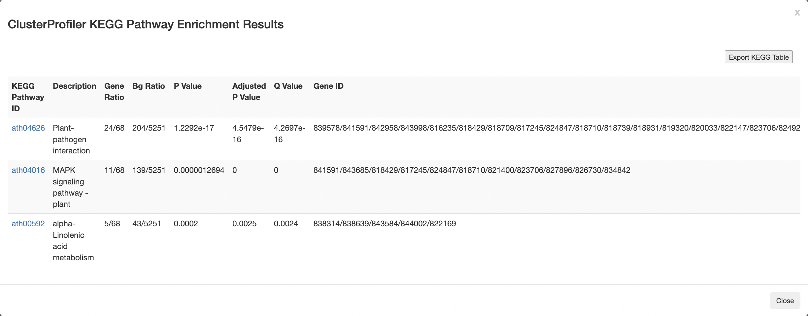
_**Figure 15.** KEGG pathway enrichment results table._

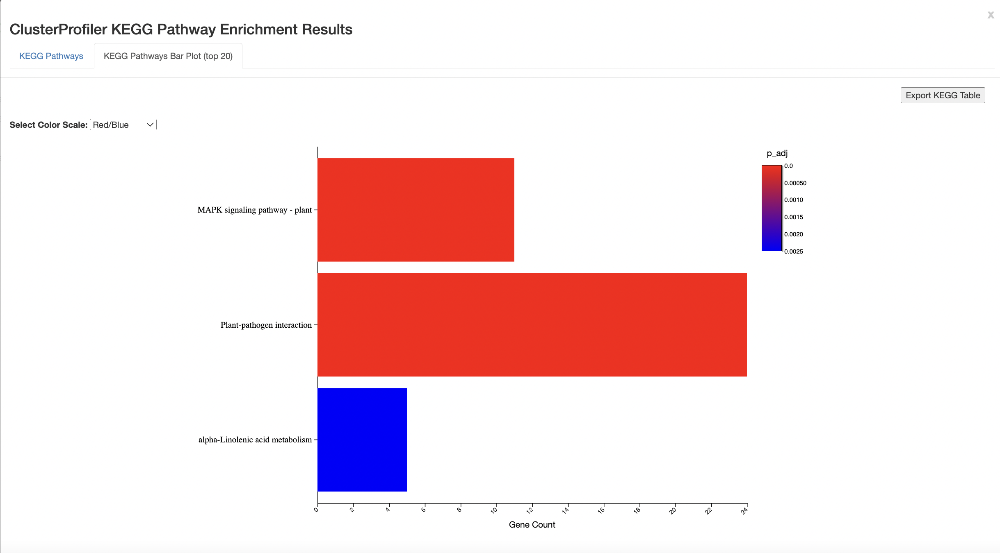
_**Figure 16.** KEGG pathway enrichment bar plot visualization created from KEGG pathway enrichment results._

#### Divenn2 Information Mapping Flow
ID mapping is necessary for GO enrichment analysis and KEGG pathway enrichment analysis in some cases. Mapping is performed depending on the input ID type and species. Some species do not have annotation data for gene ID mapping so custom annotation files were created to supplement our database. Figure 17 shows the flow for ID mapping. In general, NCBI/Entrez IDs are acceptable for all organisms, although a couple of organisms have limited NCBI/Entrez IDs available in our database so enrichment analysis may not yield sufficient results. There is no mapping from Ensembl and Uniprot IDs to the following organisms: ddi, mpo, ppa (Dictyostelium discoideum, Marchantia polymorpha, and Physcomitrella patens respectively).

More information about species mapping and sample species IDs can be found in the "Sample Data" section of from the homepage. The ID table is viewable under Species ID Samples and Reference.

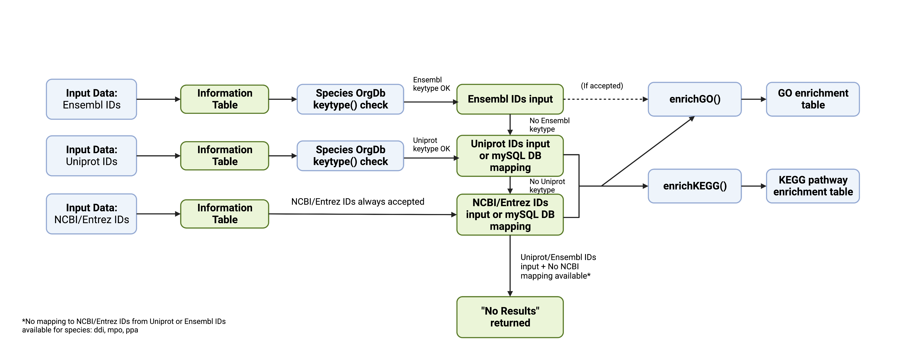
_**Figure 17.** ID mapping scheme/flow for user input data._

# Open Source
Visualization tools [D3.js](https://github.com/d3/d3) and a lightweight graphical user interface 
[dat.GUI](https://github.com/dataarts/dat.gui)

