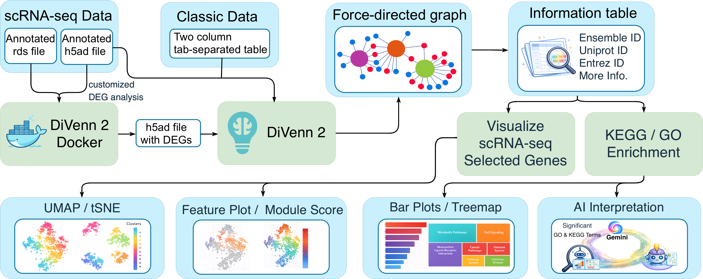
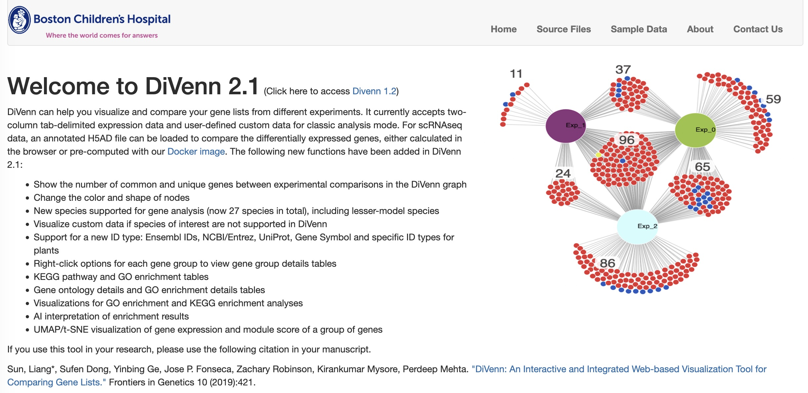
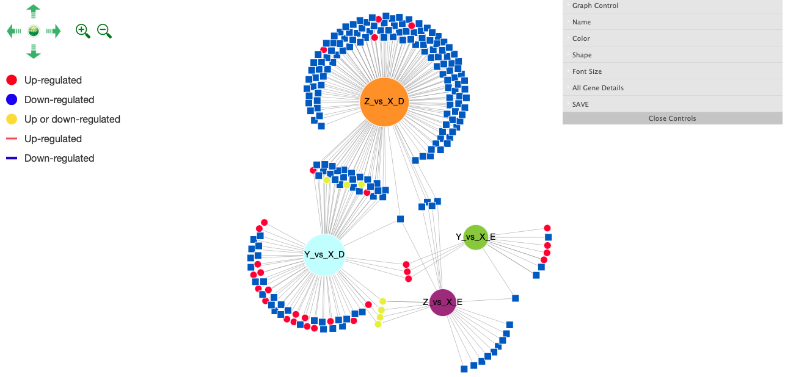
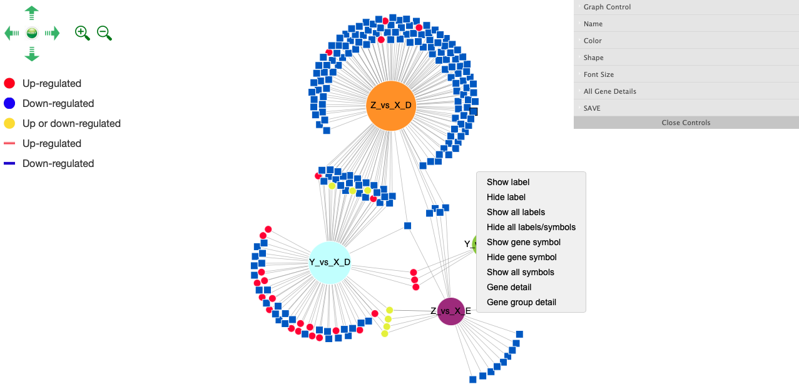
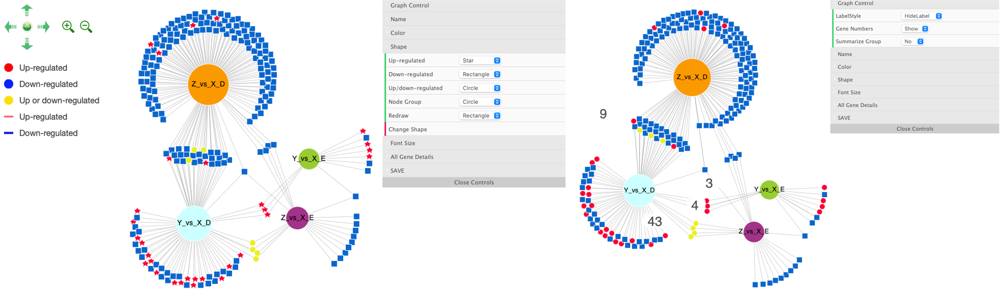
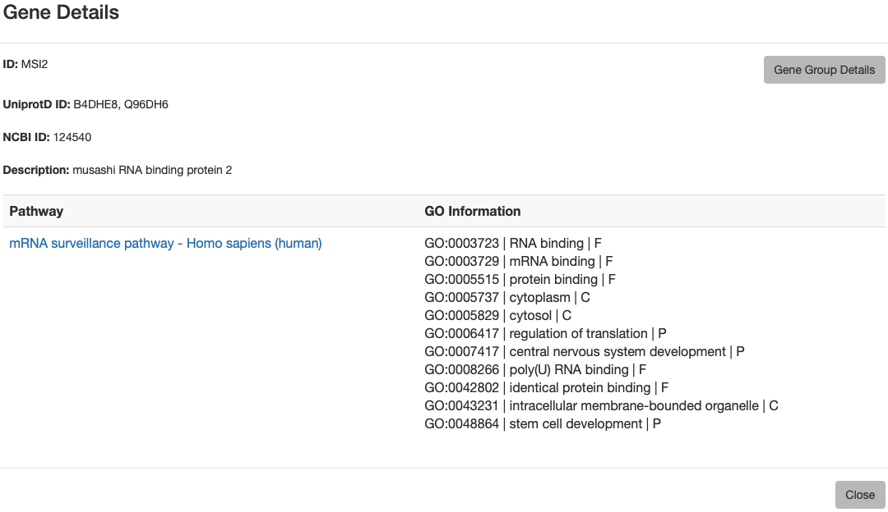
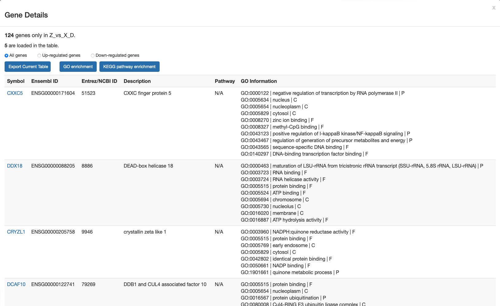

## **DiVenn 2**

**An Interactive and integrated web-based visualization and enrichment tool for comparing gene lists for bulk and single-cell RNA-seq data**

🔗 **Launch DiVenn 2**: https://divenn.tch.harvard.edu/v2

📄 **Original publication**: [Front. Genet. 2019 – DiVenn](https://www.frontiersin.org/journals/genetics/articles/10.3389/fgene.2019.00421/full)

🎥 **Tutorial video**: [Watch on YouTube](https://www.youtube.com/watch?v=OypczjArKoo)

---

<figure align="center">
  
  <figcaption>DiVenn 2 Flow chart</figcaption>
</figure>

<figure align="left">
  
  <figcaption>Figure 1: DiVenn 2 home page interface. Classic analysis mode and a new scRNAseq analysis mode can be selected.</figcaption>
</figure>

---

### Table of Contents
- [Overview](#Overview)
- [Introduction](#Introduction)
- [Key Features](#Key-Features)
- [Input & Data Preparation](#Input-&-Data-Preparation)
  - [Classic Analysis](#Classic_Analysis)
  - [Single-cell RNA-seq Analysis](#Single-cell-RNA-seq-Analysis)
- [Visualization & Interaction](#[Visualization-&-Interaction)
- [Enrichment Analysis](#Enrichment-Analysis)
- [scRNAseq analysis and visualization](#scRNAseq-analysis-and-visualization)
- [Export Options](#Export-Options)
- [Citation](#Citation)

### Overview
DiVenn 2 is a major upgrade to the original [DiVenn platform](https://www.frontiersin.org/journals/genetics/articles/10.3389/fgene.2019.00421/full), 
developed to support comprehensive and customizable comparison of gene lists from **bulk** level omics data and **single-cell RNA-seq (scRNA-seq)** datasets.
This release brings enhanced visualization, expanded species and ID support, built-in GO/KEGG enrichment tools, AI interpretation of enrichment results, and scRNAseq data analysis and visualization all through a simple, interactive web interface.

### Introduction
Gene expression data from different biological states - such as mutant, double mutant, and wild-type samples - are commonly compared using Venn diagram tools. These comparisons help identify shared and unique genes
between conditions and gain insights into their biological roles, especially through associated pathways and gene ontology (GO) terms.

To address the limitations of static Venn diagrams and to better explore these relationships, we originally developed [DiVenn](https://divenn.tch.harvard.edu), an interactive web-based tool
that visualizes gene list overlaps using force-directed graphs enriched with integrated biological annotations. 
The platform was widely adopted for its ability to provide expression context and functional annotation through connected GO and KEGG pathway data.

Building on that foundation, **DiVenn 2** is a major upgrade to the original version. This release introduces new functionalities designed to support **bulk and scRNA-seq** workflows with greater customization, scalability, and analytic depth.

#### Key Features:
  
-   Comparison of up to **15 gene sets** simultaneously.
-   Supports both **bulk** and **scRNA-seq** inputs.
-   Interactive **force-directed network graphs** for dynamic visulaization.
-   Integrated **GO/KEGG pathway enrichment analysis** via the `clusterProfiler` R package.
-   High-resolution plot and interactive interactive exports.
-   Support **27 species**, including lesser-studied organisms. 
-   Accepts multiple gene ID types: **NCBI/Entrez, Ensembl, UniProt, Gene Symbol and Plant-specific ID types**.
-   Built-in scripts and Docker pipelines for scRNA-seq data preprocessing.

DiVenn 2 is freely available at <https://divenn.tch.harvard.edu/v2>.

---

### Input & Data Preparation

#### Classic Analysis
DiVenn 2 accepts two input format for classic analysis: 

- **Two-column tab-delimited files**: 
  - First column: Gene IDs
  - Second column: Gene regulation values (1 for up-regulated, 2 for down-regulated genes)
 
- **Gene expression data**: The first column is gene IDs and the second column is gene regulation values. The gene regulation value should be obtained 
from differentially expressed (DE) genes. Users can select the cut-off value of fold change (for example, two-fold change) to define their DE genes. 
To simplify this gene regulation value, we require users to use “1” to represent up-regulated genes and “2” to represent down-regulated genes based 
on their own cut-off value of fold change. Additional columns can be added to include custom annotations, which could be useful for unsupported sepcies.

👉 [Sample Files](https://divenn.tch.harvard.edu/v2/data.php)

##### Interface Instructions
1. Select the `Classic Analysis` tab on the DiVenn homepage.  
2. Choose your species (requited for pathway/GO enrichment).
3. Select input ID type and number of experiments (up to 15).
4. Upload files for each experiment.
5. Click `Submit` to visualize.

<figure align="left">
  
  <figcaption>Figure 2: Data input in classic analysis mode</figcaption>
</figure>

#### Single-cell RNA-seq Input

A annotated `.h5ad` (H5 AnnData) file of single-cell data is accepted as the input. If users have a `.rds` file from the Seurat pipeline, we provide a Docker pipeline to preprocess and convert the data. DiVenn can perform differentially expressed gene analysis with default methods and parameters in Seurat and Scanpy. Users can use the Docker pipeline described below to adjust the parameters.

**Note**: Only Chrome and FireFox are supported for processing `.h5ad` files in the browser. Due to techinical limitations, Chrome can only work with files smaller than 2GB. If you encounter problems with large files (for example larger than 5GB), please consider using our Docker pipeline for preprocessing.

##### Docker Pipeline
- Accept `.rds` (Seurat) or `.h5ad` (Scanpy) files.
- Performs DEG analysis and generates a `.h5ad` file with computed DEGs.
- [Docker workflow details](https://github.com/BCH-RC/DiVenn2/tree/main/scRNAseq_preprocessing/docker)

<figure align="left">
  
  <figcaption>Figure 3: Workflow of the Docker pipeline for DEG preprocessing</figcaption>
</figure>

##### Interface Instructions
1. Select the `scRNAseq Analysis` tab.
2. Choose your species.
3. Choose the ID type.
4. Click the `H5AD` button to a separate page.

<figure align="left">
  
  <figcaption>Figure 4: Interface of scRNAseq data input</figcaption>
</figure>

In the new page, users can load a `.h5ad` file. DiVenn will detect whether the file contains DEG results either from the Docker pipeline or Scanpy. Users can select DEG lists for visualization and comparison in DiVenn.

<figure align="left">
  
  <figcaption>Figure 5: Interface to select precomputed DEG lists from scRNAseq data</figcaption>
</figure>

If no DEG results are found, users can select annotations from the file to calculate DEGs on the fly. Users should first choose the annotation of comparison conditions (e.g. disease and control) and then the cell subsets to compare in (e.g. cell types). The selected annotations will be used in the next step to select the comprisons. For example, condition 1 vs condition 2 in selected cell subsets, respectively. Multiple selection is supported with pressing the Shift key. More pairs of conditions can be added by clicking `Add Condition`. After clicking `Calcualte DEG`, the significant DEG lists will be shown similar to the precomputed results.

<figure align="left">
  
  <figcaption>Figure 6: Interface to select DEG comparisons</figcaption>
</figure>

<figure align="left">
  
  <figcaption>Figure 7: scRNA Force Directed Graph</figcaption>
</figure>

##### Notes
- Use your own comparison names (e.g. `WT_vs_KO`), but **do not start names with a number**
- You can choose from four gene ID types (Ensembl, Uniprot, gene symbol and NCBI/Entrez. (see [ID Mapping](#species-and-id-mapping))
- You can upload up to 15 experiment data sets for comparison 
- Choose between 27 supported species from a drop-down menu

---

### Visualization & Interaction

#### Force-Directed Graph
- Scrolling with the mouse wheel on the graph will zoom into/out of the graph.
- Left-clicking will highlight edges (expression patterns). 
- Double-clicking the same node will hide the connecting edge colors.
- Right-clicking a node will show five function options: show or hide one or all node labels, show all gene associated pathways, or GO terms.
- Right-clicking nodes can show the gene IDs of interest (See figure 8)

<figure align="left">
  
  <figcaption>Figure 8: Right-click functions</figcaption>
</figure>

#### Customization
- Adjust font size, color, and node shape (See figure 9)
- Summarize groups and collapse nodes
- Filter by condition, GO term, or pathway

<figure align="left">
  
  <figcaption>Figure 9: Customize Appearance</figcaption>
</figure>

#### Gene Information
Access detailed gene information by right-clicking nodes and select `Gene detail` (See figure 10)

<figure align="left">
  
  <figcaption>Figure 10: Gene Info</figcaption>
</figure>

---

### Enrichment Analysis

#### KEGG pathway and GO terms
If users need to check the KEGG pathway or GO terms of a group of genes (for example, regulated genes in group Z versus group D in cell type D), they can choose the `Gene group detail` option after right clicking the node (See figure 11).

<figure align="left">
  
  <figcaption>Figure 11: Genes in a group with KEGG and GO annotations</figcaption>
</figure>

#### GO Enrichment
To perform GO enrichment for this set of genes, users need to click `GO enrichment` tab. It uses `clusterProfiler` R package to perform GO enrichment.
User also can switch different GO enrichment results namely Biological Process (BP), Molecular Function (MF), and Cellular Component (CC). In the tab of each GO category, bar chart (figure 12), tree map plot (figure 13), AI interpretation (figure 14) and result table (figure 15) can be viewed.

By default, bar chart shows up to 20 significant terms. The GO terms to show can be adjusted from the result table.
<figure align="left">
  
  <figcaption>Figure 13: GO Barplot</figcaption>
</figure>

Tree map summaries the GO terms based on GO hierarchy when more than 10 terms are selected.
<figure align="left">
  
  <figcaption>Figure 14: GO tree map</figcaption>
</figure>

The enrichment results are sent to Google's Gemma model for interpretation. Users can add experimental background to help improve the interpretation.
<figure align="left">
  
  <figcaption>Figure 15: GO AI interpretation</figcaption>
</figure>

Users can select GO terms and update all the above visualization and AI interpretation results. Multiple select with pressing the Shift key is supported.
<figure align="left">
  
  <figcaption>Figure 16: GO result table</figcaption>
</figure>

#### KEGG Enrichment
Similar to GO enrichment, user can perform KEGG pathway analysis by selecting the `KEGG pathway enrichment` and generate the same visualization, AI interpretation, and result table.

<figure align="left">
  
  <figcaption>Figure 17: KEGG Barplot</figcaption>
</figure>

Tree map summaries KEGG pathways based on KEGG BRITE database when more than 10 pathways are selected.
<figure align="left">
  
  <figcaption>Figure 18: KEGG tree map</figcaption>
</figure>

The enrichment results are sent to Google's Gemma model for interpretation. Users can add experimental background to help improve the interpretation.
<figure align="left">
  
  <figcaption>Figure 19: KEGG AI interpretation</figcaption>
</figure>

Users can select KEGG pathways and update all the above visualization and AI interpretation results. Multiple select with pressing the Shift key is supported.
<figure align="left">
  
  <figcaption>Figure 20: KEGG result table</figcaption>
</figure>

---

### scRNAseq analysis and visualization
When the input `.h5ad` file of scRNAseq data contains UMAP and t-SNE coordinates stored in standard `X_UMAP` and `X_TSNE` slots, DiVenn can visualize expression of individual genes on the dimension reduction plot (often called feature plot). When right clicking on a gene node in the Divenn graph, there is a `Feature plot` menu option that will open a new page.

Users can color the cells by annotations in the file and search for genes to get feature plots. Cell groups can be hidden by unselecting from the annotation list.

<figure align="left">
  
  <figcaption>Figure 21: Feature plot</figcaption>
</figure>

From the `Gene group detail` window, users can also navigate the UMAP/t-SNE page by clicking the `UMAP/t-SNE` button. The `addModuleScore` algorithm from the Seurat package will be used to calculate the module score for this gene group (overlapping between multiple comparisons or unique to a comparison) and use the score to color the dimension reduction plot.

<figure align="left">
  
  <figcaption>Figure 22: UMAP plot colored by module score</figcaption>
</figure>

---

### Export Options

You can export:

- Network diagrams
- Bar plots
- Enrichment tables (.csv)
- Gene/group details reports

---

### Citation

Please cite the original DiVenn publication if you use this tool:

> **Sun et al.** *DiVenn: An Interactive and Integrated Web-Based Visualization Tool for Comparing Gene Lists*. Front. Genet. 2019.  
> [https://doi.org/10.3389/fgene.2019.00421](https://doi.org/10.3389/fgene.2019.00421)

---

## Contact & Contributions

DiVenn is developed and maintained by the **Research Computing Bioinformatics Team at Boston Children Hospital**.  
For issues or feature requests, [open an issue](https://github.com/BCH-RC/DiVenn2/issues) or reach out through the homepage.

