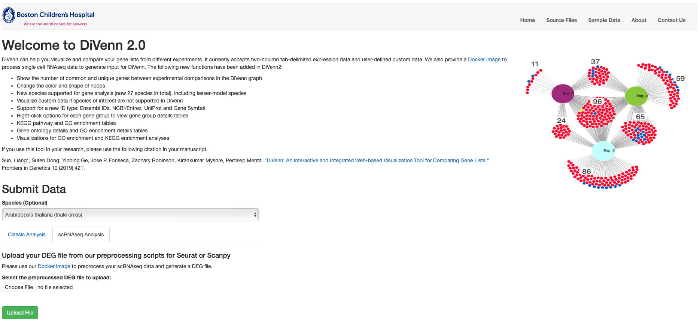
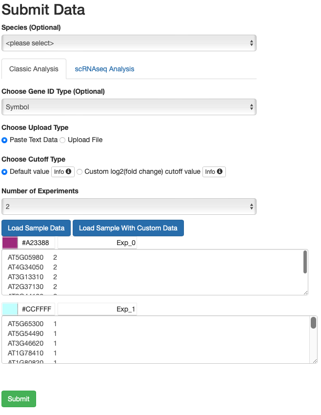
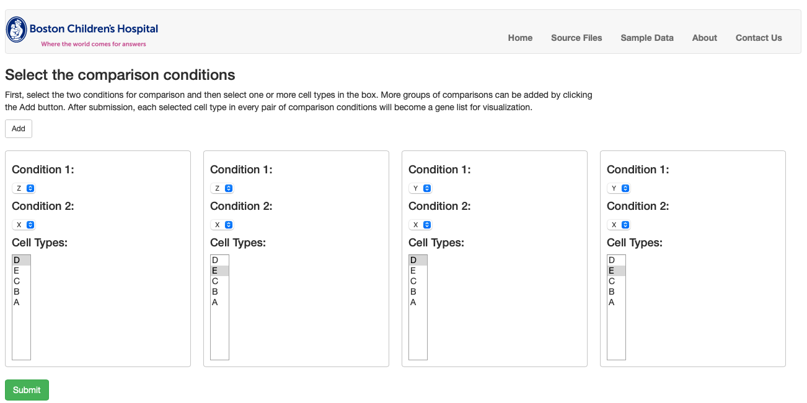
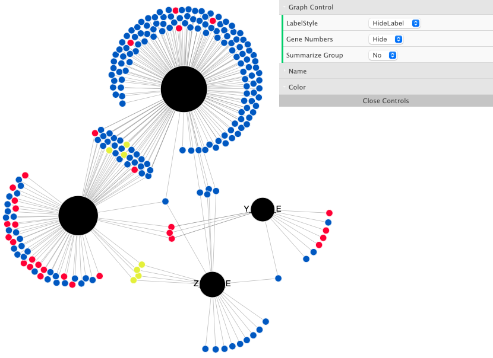

## **DiVenn 2.0**

**An Interactive and integrated web-based visualization and enrichment tool for comparing gene lists for bulk and single-cell RNA-seq data**

🔗 **Launch DiVenn 2.0**: https://divenn.tch.harvard.edu/v2

📄 **Original publication**: [Front. Genet. 2019 – DiVenn](https://www.frontiersin.org/journals/genetics/articles/10.3389/fgene.2019.00421/full)

🎥 **Tutorial video**: [Watch on YouTube](https://www.youtube.com/watch?v=OypczjArKoo)

---

  
*Figure1: DiVenn 2.0 home page interface. Users can upload DEG files and select between classic bulk RNA-seq or scRNA-seq modes for visualization and enrichment.*

---

### Table of Contents
- [Overview](#Overview)
- [Introduction](#Introduction)
- [Key Features](#Key Features)
- [Input & Data Preparation](#Input & Data Preparation)
  - [Bulk RNA-seq Input](#Bulk RNA-seq Input)
  - [Single-cell RNA-seq Input](#Single-cell RNA-seq Input)
- [Visualization & Interaction](#[Visualization & Interaction)
- [Enrichment Analysis](#Enrichment Analysis)
- [Species and ID Mapping](#Species and ID Mapping)
- [Export Options](#Export Options)
- [Citation](#Citation)

### Overview
DiVenn 2.0 is a major upgrade to the original [DiVenn platform](https://www.frontiersin.org/journals/genetics/articles/10.3389/fgene.2019.00421/full), 
developed to support comprehensive and customizable comparison of gene lists from **bulk** and **single-cell RNA-seq (scRNA-seq)** datasets.
This release brings enhanced visualization, expanded species and ID support, and built-in GO/KEGG enrichment tools, all through a simple, interactive web interface.

### Introduction
Gene expression data from different biological states—such as mutant,double mutant, and wild-type samples—are commonly compared using Venn diagram tools. These comparisons help identify shared and unique genes
between conditions and gain insights into their biological roles, especially through associated pathways and gene ontology (GO) terms.

To address the limitations of static Venn diagrams and to better explore these relationships, we originally developed [DiVenn](https://divenn.tch.harvard.edu), an interactive web-based tool
that visualizes gene list overlaps using force-directed graphs enriched with integrated biological annotations. 
The platform was widely adopted for its ability to provide expression context and functional annotation through connected GO and KEGG pathway data.

Building on that foundation, **DiVenn 2.0** is a major upgrade to the original version. This release introduces new functionalities designed to support **bulk and scRNA-seq** workflows with greater customization, scalability, and analytic depth.

#### Key Features:
  
-   Compare up to **15 gene sets** simultaneously;
-   Supports **bulk** and **scRNA-seq** inputs;
-   Visualize results with customizable **force-directed network graphs**;
-   Perform **GO/KEGG** pathway enrichment analysis using `clusterProfiler` R package;
-   Export high-resolution plots and interactive tables;
-   Choose from **27 species**, including lesser-model species 
-   Support **4 gene ID types** including NCBI/Entrez, Ensembl, UniProt, and gene symbol;
-   Built-in scripts and Docker pipeline for scRNA-seq DEG preparation.

The application is freely available at <https://divenn-dev.tch.harvard.edu/v3_yl/index.php>.

---

### Input & Data Preparation

#### 1. Bulk RNA-seq Input
DiVenn currently accepts two types of input data: 

- **Two-column tab-delimited files**: For example, gene ID and corresponding pathway data, transcription factors and their regulated downstream genes, 
and microRNAs and corresponding target genes. The second column must be "1" or "2".The first column is gene IDs and the second column is gene regulation 
value. The second column must be '1' or '2'. we require users to use '1' to represent up-regulated genes and '2' to represent down-regulated genes based on their own cut-off value of fold change.

- **Gene expression data**: The first column is gene IDs and the second column is gene regulation value. The gene regulation value should be obtained 
from differentially expressed (DE) genes. Users can select the cut-off value of fold change (for example, two-fold change) to define their DE genes. 
To simplify this gene regulation value, we require users to use “1” to represent up-regulated genes and “2” to represent down-regulated genes based 
on their own cut-off value of fold change. If users need to link their genes to the KEGG pathway (Kanehisa and Goto, 2000) or GO database, 
27 model species are supported in DiVenn. Currently, three types of gene IDs : KEGG, Uniprot (UniProt, 2008) and NCBI (Benson, et al., 2018), 
are accepted for pathway analysis. All agriGO (Du, et al., 2010; Tian, et al., 2017) supported IDs are supported for GO analysis by 
DiVenn ([View table] or download in [Excel]). 

Sample data available here: [Sample Files](https://divenn.tch.harvard.edu/v2/data.php)

##### Interface Instructions
1. Go to the `Classic Analysis` tab on the DiVenn homepage  
2. Choose from the upload Type
3. Select the number of experiments (up to 15 experiments can be loaded)
4. Load your data per each experiment
4. Click `Submit` to generate the graph

  
  
<em>Figure 2: RNAseq load Data</em>

#### 2. Single-cell RNA-seq Input

Single-cell data must be **preprocessed** using our Docker pipeline to ensure compatibility.

##### Input Format
CSV with 5 required columns (see examples in [Test Data](https://github.com/BCH-RC/DiVenn2/tree/main/scRNAseq_preprocessing/TestData)):

- `Condition_1`, `Condition_2`, `CellType`, `Gene`, `Reg_direct`

##### Docker Pipeline
Use the provided [Docker workflow](https://github.com/BCH-RC/DiVenn2/tree/main/scRNAseq_preprocessing/docker) which:

- Accept `.rds` (Seurat) or `.h5ad` (Scanpy)
- Perform DEG analysis and filtering
- Generate DiVenn-compatible CSV

##### Interface Instructions
1. Go to the `scRNAseq Analysis` tab on the DiVenn homepage  
2. Upload your processed `.csv` file  
3. Select two comparison conditions and one or more cell types. 
4. Click `Submit` to generate the graph

  
  
<em>Figure 2: scRNA Condition Select</em>

  
  
<em>Figure 2: scRNA Force Directed Graph</em>

##### Notes
- Use your own comparison names (e.g. `WT_vs_KO`), but **do not start names with a number**
- You can choose from four gene ID types (Ensembl, Uniprot, gene symbol and NCBI/Entrez. (see [ID Mapping](#species-and-id-mapping))
- You can upload up to 15 experiment data sets for comparison 
- Choose between 27 supported species from a drop-down menu

---

### Visualization & Interaction

- Scrolling with the mouse wheel on the graph will zoom into/out of the graph.
- Left-clicking will highlight edges (expression patterns). 
- Double-clicking the same node will hide the connecting edge colors.
- Right-clicking a node will show five function options: show or hide one or all node labels, show all gene associated pathways, or GO terms.
- Right-clicking nodes can show the gene IDs of interest

#### Customization

- Adjust font size, color, and node shape
- Summarize groups and collapse nodes
- Filter by condition, GO term, or pathway

  

---

### Enrichment Analysis

#### GO Enrichment
- Uses `enrichGO` from `clusterProfiler`
- Separate tabs for:
  - All
  - Biological Process (BP)
  - Molecular Function (MF)
  - Cellular Component (CC)

  

#### KEGG Enrichment
- Uses `enrichKEGG`
- Interactive table and bar plots
- Change color scheme (4 presets)

  

---

### Species and ID Mapping

- Supports **278 species**, including lesser-model organisms
- Accepts:
  - Entrez, Ensembl, UniProt, Gene Symbol
- Custom mappings added for species without standard annotations
- Example organisms with limited mapping: *Dictyostelium discoideum*, *Marchantia polymorpha*, *Physcomitrella patens*

---

### Export Options

You can export:

- SVG network diagrams
- Bar plots (top 20 terms per category)
- Pathway/GO tables (.txt)
- Gene details or group tables

---

### Citation

Please cite the original DiVenn publication if you use this tool:

> **Sun et al.** *DiVenn: An Interactive and Integrated Web-Based Visualization Tool for Comparing Gene Lists*. Front. Genet. 2019.  
> [https://doi.org/10.3389/fgene.2019.00421](https://doi.org/10.3389/fgene.2019.00421)

---

## Contact & Contributions

DiVenn is developed and maintained by the **Bioinformatics Core at Boston Children's Hospital**.  
For issues or feature requests, [open an issue](https://github.com/BCH-RC/DiVenn2/issues) or reach out through the homepage.

