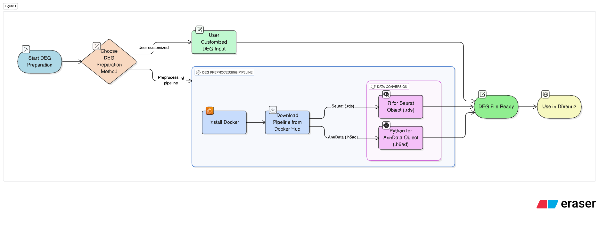

# **DiVenn2 DEG Preprocessing Pipeline**



## 🔄 Custom DEG Table Input (User-Supplied CSV)

the DiVenn2 DEG preprocessing pipeline supports custom DEG table inputs directly from users. This allows users who have already performed differential expression analysis in their own environments (outside of the container) to supply pre-formatted CSV files, bypassing the need to run the built-in DEG preprocessing steps. These customized DEG tables must follow the standard DiVenn2 format as described in the '📤  **Output Format**' section: each row should contain Condition_1, Condition_2, CellType, Gene, and Reg_direct, where Reg_direct is 1 for upregulated and 2 for downregulated genes in Condition_1. By supporting this flexible input mode, users can seamlessly integrate their existing pipelines and tools with DiVenn2’s powerful visualization capabilities.

The following sections contain scripts and a Docker/Singularity-based environment for preprocessing single-cell datasets in **h5ad** and **rds (Seurat obj)** formats to generate differentially expressed gene (DEG) files as input for **DiVenn2**. The containerized setup ensures reproducibility and consistency across computing environments.

## **Docker Image**
The preprocessing pipeline is encapsulated in a pre-built Docker image:

🛠 **Docker Hub:** [rcbioinfo/divenn2_degpreprocessing:v2](https://hub.docker.com/r/rcbioinfo/divenn2_degpreprocessing)

To build the Docker image locally:

```bash
docker build -t divenn2_degpreprocessing:v2 .
```

## ⚙️ **Installation Instructions**
To use the DEG preprocessing pipeline, Docker (or Singularity, for HPC systems) must be installed and running/loaded on your system. Docker allows you to run applications in isolated environments called containers, ensuring consistency and reproducibility.

### 🔧 **Docker Setup by Platform:**

#### macOS
Download and Install Docker Desktop on Mac:  
👉 [https://docs.docker.com/desktop/setup/install/mac-install/](https://docs.docker.com/desktop/setup/install/mac-install/)

#### Windows
Download and Install Docker Desktop on Windows:  
👉 [https://docs.docker.com/desktop/setup/install/windows-install/](https://docs.docker.com/desktop/setup/install/windows-install/)

#### Linux (Ubuntu)
Download and Install Docker Desktop on Linux:  
👉 [https://docs.docker.com/desktop/setup/install/linux/](https://docs.docker.com/desktop/setup/install/linux/)

### Get Started
Explore Docker Desktop:
👉 [https://docs.docker.com/desktop/use-desktop/](https://docs.docker.com/desktop/use-desktop/)

## 🧪 **Using Singularity (for HPC):**
To use this pipeline in HPC environments, convert the Docker image into a Singularity image:
```bash
singularity pull divenn2_degpreprocessing.sif docker://rcbioinfo/divenn2_degpreprocessing:v2
```

## **Folder Contents**

| File | Description |
|------|------------|
| **Dockerfile** | The script used to build the Docker image. |
| **Preprocessing_h5ad.py** | Python script for processing **h5ad** files to generate DEG files as input for DiVenn2. |
| **Preprocessing_Seuratobj.r** | R script for processing **rds (Seurat obj)** files to generate DEG files as input for DiVenn2. |
| **run_preprocessing.sh** | Wrapper script that allows users to run either `Preprocessing_h5ad.py` or `Preprocessing_Seuratobj.r` based on file type. |
| **runtime_code_python.sh** | Shell script for running the preprocessing pipeline inside the Docker container using the **h5ad** format. |
| **runtime_code_r.sh** | Shell script for running the preprocessing pipeline inside the Docker container using the **rds (Seurat obj)** format. |
| **README.md** | This documentation file. |

---

## **Running the Pipeline**
### **Using Docker**
The following examples show how to run the Docker container for processing **h5ad** and **Seurat** files.

#### **Example: Running the Pipeline for an h5ad File (Python)**
```bash
CONTAINER_ID=$(docker run -d \
  -v .../DiVenn2/scRNAseq_preprocessing/TestData:/data \
  rcbioinfo/divenn2_degpreprocessing:latest h5ad \
  -w /data \
  -i /data/TestInput.h5ad \
  -c group \
  -g celltype \
  -o /data/TestOutput_h5ad.csv \
  -f 0.2 \
  -r 0.01 \
  -v 0.05 \
  -x all
)
```

#### **Example: Running the Pipeline for a rds File (R)**
```bash
CONTAINER_ID=$(docker run -d \
  -v .../DiVenn2/scRNAseq_preprocessing/TestData:/data \
  rcbioinfo/divenn2_degpreprocessing:latest seurat \
  -w /data \
  -i /data/TestInput.rds \
  -c group \
  -g celltype \
  -o /data/TestOutput_seurat.csv \
  -f 0.2 \
  -r 0.1 \
  -v 0.05 \
  -x all \
  -m wilcox
)

```
### **Using Singularity on HPC Server**
Make sure to load Singularity on your HPC system (e.g., via module load singularity), then run:

#### **Example: Running the Pipeline for an h5ad File (Python)**
```bash
singularity run -B ../DiVenn2/scRNAseq_preprocessing/TestData:/data \
  divenn2_degpreprocessing.sif h5ad \
  -w /data \
  -i /data/TestInput.h5ad \
  -c group \
  -g celltype \
  -o /data/TestOutput_h5ad.csv \
  -f 0.2 \
  -r 0.01 \
  -v 0.05 \
  -x all
```

#### **Example: Running the Pipeline for a rds File (R)**
```bash
singularity run -B ../DiVenn2/scRNAseq_preprocessing/TestData:/data \
  divenn2_degpreprocessing.sif seurat \
  -w /data \
  -i /data/TestInput.rds \
  -c group \
  -g celltype \
  -o /data/TestOutput_seurat.csv \
  -f 0.2 \
  -r 0.1 \
  -v 0.05 \
  -x all \
  -m wilcox
```

### **Parameter Descriptions**
| **Parameter** | **Description** |
|--------------|----------------|
| `-w, --workdir` | The working directory where files will be processed and stored. |
| `-i, --input` | Input file path (**h5ad** or **Seurat** format). |
| `-c, --condition` | Column name representing the sample condition (e.g., disease vs. normal). |
| `-g, --group` | Column name representing the cell type or other grouping variable. |
| `-o, --output` | Output file path for the processed DEG results (CSV format). |
| `-f` | Log fold-change filtering threshold for Seurat data (default: `0.2`). |
| `-r` | Minimum proportion of cells expressing a gene in one condition (default: `0.1`). |
| `-v` | Adjusted p-value threshold for Seurat data (default: `0.05`). |
| `-x, --comparisons` | Condition pairs for differential expression analysis (e.g., `"X:Y,X:Z"`). Use `"all"` for all possible comparisons. |
| `-m, --method` | Denotes which test to use. \n Available options for R are: 'wilcox', 'wilcox_limma', 'bimod', 'roc', 't', 'negbinom', 'poisson', 'LR', 'MAST'.

---

## 📤  **Output Format**
The DEG preprocessing pipeline produces a standardized output file in **CSV format**, where each row represents the differential expression status of a gene between each user-defined condition pair and cell type.

| **Condition_1** | **Condition_2** | **CellType** | **Gene** | **Reg_direct** |
|--------------|----------------|--------------|----------------|----------------|
| X | Z | D | RNF220 | 1 |
| X	| Z	| D	| FRMD5	| 1 |
| X	| Z	| D	| AC092691.1 | 1 |
| X | Z | D | TNRC6B | 1 |

where 
- `Condition_1` and `Condition_2`: Conditions being compared. (e.g., disease vs control)
- CellType: Cell type (or group) where DEG analysis was performed
- Gene: Gene symbol
- Reg_direct: Direction of regulation - 1 = upregulated in Condition_1, 2 = downregulated in Condition_1

This structure enables consistent input for DiVenn2 and supports downstream visualization of DEG intersections across multiple conditions and cell types.

---

## 📝 **Notes**
- Ensure **Docker** or **Singulatiry** are installed and running before executing the commands.
- The **volume mount (`-v /path/to/data:/data`)** should be updated to reflect your actual file locations.
- The container runs in **detached mode (`-d`)**, so you may use the following command to monitor progress:
  ```bash
  docker logs -f $CONTAINER_ID
