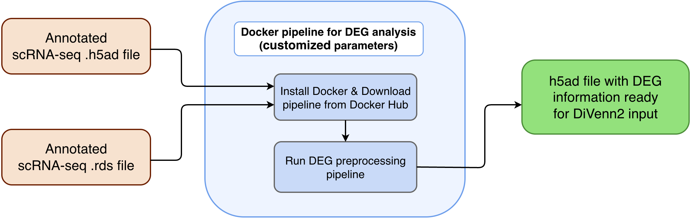

# **DiVenn 2 DEG Preprocessing Pipeline**

If your data is already in **.h5ad** format, we recommend using the DiVenn 2 website first, as it provides the most straightforward workflow with default DEG parameters. Annotated scRNA-seq data in either **.h5ad** or **.rds** format can be used as input for DEG preprocessing. **.h5ad** files can be processed through the Docker-based pipeline when customized DEG parameters are needed, whereas .rds files must be processed through the Docker-based pipeline. In the Docker workflow, users install Docker, download the pipeline from Docker Hub, and run DEG preprocessing locally. The final output is an .h5ad file containing DEG information that is ready for DiVenn 2 input.



The following sections contain scripts and a Docker/Singularity-based environment for preprocessing single-cell datasets in **h5ad** and **rds (Seurat obj)** formats to generate differentially expressed gene (DEG) files as input for **DiVenn 2**. The containerized setup ensures reproducibility and consistency across computing environments.

## **Docker Image**
The preprocessing pipeline is encapsulated in a pre-built Docker image:

🛠 **Docker Hub:** [rcbioinfo/divenn2_degpreprocessing:07_18](https://hub.docker.com/r/rcbioinfo/divenn2_degpreprocessing:07_18)

To build the Docker image locally:

```bash
docker build -t divenn2_degpreprocessing:07_18 .
```

## ⚙️ **Installation Instructions**
To use the DEG preprocessing pipeline, Docker (or Singularity, for HPC systems) must be installed and running/loaded on your system. Docker allows you to run applications in isolated environments called containers, ensuring consistency and reproducibility.

### 🔧 **Docker Setup by Platform:**

#### macOS
Download and Install Docker Desktop on Mac:  
👉 [https://docs.docker.com/desktop/setup/install/mac-install/](https://docs.docker.com/desktop/setup/install/mac-install/)

#### Windows
Download and Install Docker Desktop on Windows:  
👉 [https://docs.docker.com/desktop/setup/install/windows-install/](https://docs.docker.com/desktop/setup/install/windows-install/)

#### Linux (Ubuntu)
Download and Install Docker Desktop on Linux:  
👉 [https://docs.docker.com/desktop/setup/install/linux/](https://docs.docker.com/desktop/setup/install/linux/)

### Get Started
Explore Docker Desktop:
👉 [https://docs.docker.com/desktop/use-desktop/](https://docs.docker.com/desktop/use-desktop/)

## 🧪 **Using Singularity (for HPC):**
To use this pipeline in HPC environments, convert the Docker image into a Singularity image:
```bash
singularity pull divenn2_degpreprocessing.sif docker://rcbioinfo/divenn2_degpreprocessing::07_18
```

## **Folder Contents**

| File | Description |
|------|------------|
| `Dockerfile` | The script used to build the Docker image. |
| `Preprocessing_h5ad.py` | Python script for processing **h5ad** files to generate DEG files as input for DiVenn 2. |
| `Preprocessing_Seuratobj.r` | R script for processing **rds (Seurat obj)** files to generate DEG files as input for DiVenn 2. |
| `run_preprocessing.sh` | Wrapper script that allows users to run either `Preprocessing_h5ad.py` or `Preprocessing_Seuratobj.r` based on file type. |
| `README.md` | This documentation file. |
---

## **Running the Pipeline**

Both workflows require an annotated object with:

- A metadata column identifying the condition to compare, passed with `-c, --condition`.
- A metadata column identifying the cell group, cell type, or cluster to run DE within, passed with `-g, --group`.
- At least 3 cells for each condition within a cell group. Comparisons with fewer cells are skipped.

The `.h5ad` workflow uses `scanpy.tl.rank_genes_groups`. It uses `adata.raw.X` when usable; otherwise it uses `adata.X`. The input should already contain appropriate expression values for the selected Scanpy test, typically normalized/log-transformed data.

The Seurat workflow uses the `RNA` assay, keeps the condition and group metadata columns, and runs `FindMarkers`. It uses the `data` slot for most tests and the `counts` slot for `negbinom` and `poisson`.

### **Using Docker**
The following examples show how to run the Docker container for processing **h5ad** and **Seurat** files.

#### **Example: Running the Pipeline for an h5ad File (Python)**
```bash
CONTAINER_ID=$(docker run -d \
  -v .../DiVenn2/scRNAseq_preprocessing/TestData:/data \
  rcbioinfo/divenn2_degpreprocessing:latest h5ad \
  -w /data \
  -i /data/TestInput.h5ad \
  -c group \
  -g celltype \
  -o /data/TestOutput_h5ad.h5ad \
  -f 0.2 \
  -r 0.01 \
  -p 0.5 \
  -v 0.05 \
  -x all \
  -m wilcoxon \
  -t benjamini-hochberg
)
```

#### **Example: Running the Pipeline for a rds File (R)**
```bash
CONTAINER_ID=$(docker run -d \
  -v .../DiVenn2/scRNAseq_preprocessing/TestData:/data \
  rcbioinfo/divenn2_degpreprocessing:latest seurat \
  -w /data \
  -i /data/TestInput.rds \
  -c group \
  -g celltype \
  -o /data/TestOutput_seurat.h5ad \
  -f 0.2 \
  -r 0.1 \
  -v 0.05 \
  -x all \
  -m wilcox
)

```
### **Using Singularity on HPC Server**
Make sure to load Singularity on your HPC system (e.g., via module load singularity), then run:

#### **Example: Running the Pipeline for an h5ad File (Python)**
```bash
singularity run -B ../DiVenn2/scRNAseq_preprocessing/TestData:/data \
  divenn2_degpreprocessing.sif h5ad \
  -w /data \
  -i /data/TestInput.h5ad \
  -c group \
  -g celltype \
  -o /data/TestOutput_h5ad.h5ad \
  -f 0.2 \
  -r 0.01 \
  -p 0.5 \
  -v 0.05 \
  -x all \
  -m wilcoxon \
  -t benjamini-hochberg
```

#### **Example: Running the Pipeline for a rds File (R)**
```bash
singularity run -B ../DiVenn2/scRNAseq_preprocessing/TestData:/data \
  divenn2_degpreprocessing.sif seurat \
  -w /data \
  -i /data/TestInput.rds \
  -c group \
  -g celltype \
  -o /data/TestOutput_seurat.h5ad \
  -f 0.2 \
  -r 0.1 \
  -v 0.05 \
  -x all \
  -m wilcox
```

### **Parameter Descriptions**
| Parameter | Applies to | Description |
| --- | --- | --- |
| `h5ad` or `seurat` | Both | First argument after the image name. Selects the Python `.h5ad` workflow or the R Seurat workflow. |
| `-w, --workdir` | Both | Working directory inside the container. Usually the mounted `/data` directory. |
| `-i, --input` | Both | Input file path inside the container. Use `.h5ad` for `h5ad` mode or `.rds` for `seurat` mode. |
| `-c, --condition` | Both | Metadata column containing the sample condition, such as disease/control. |
| `-g, --group` | Both | Metadata column containing the cell type, cluster, or other grouping variable. |
| `-o, --output` | Both | Output `.h5ad` file path. A companion DEG CSV is also written by default. |
| `-f, --logfc_thd` | Both | Absolute log fold-change threshold. Defaults: `.h5ad` workflow `1`; Seurat workflow `0.1`. |
| `-r, --minpct_thd` | Both | Minimum fraction of cells expressing a gene. Defaults: `.h5ad` workflow `0.25`; Seurat workflow `0.01`. |
| `-v, --padj_thd` | Both | Adjusted p-value threshold. Default: `0.05`. |
| `-x, --comparisons` | Both | Condition comparisons as `A:B,A:C`, where `A` is Condition_1 and `B` is Condition_2. Use `all` for all directed pairwise comparisons. |
| `-m, --method` | Both | Differential expression test. See method options below. |
| `-l, --gene_list_file` | Both | Optional text file with one gene per line for post-DEG filtering. |
| `-d, --gene_filter_mode` | Both | Optional gene-list filtering mode: `remove` excludes listed genes; `keep` keeps only listed genes. |
| `-a, --gene_filter_ignore_case` | Both | Ignore case when applying the gene-list filter. |
| `-p, --maxpct_thd` | `.h5ad` only | Maximum out-group expression fraction used by Scanpy filtering. Default: `0.5`. |
| `-t, --correction_method` | `.h5ad` only | Scanpy p-value correction method: `benjamini-hochberg` or `bonferroni`. Default: `benjamini-hochberg`. |
| `-s, --write_csv` | Both | CSV behavior differs by script. In the `.h5ad` workflow, passing `-s` disables CSV writing. In the Seurat workflow, the CSV is written by default. |

Method options:

- `.h5ad` / Scanpy: `wilcoxon`, `t-test`, `t-test_overestim_var`, `logreg`.
- Seurat: `wilcox`, `wilcox_limma`, `bimod`, `roc`, `t`, `negbinom`, `poisson`, `LR`, `MAST`.

---

## 📤  **Output Format**

The primary output is a DiVenn2-ready `.h5ad` file. DEG results are embedded in `adata.uns` under keys like:

```text
rank_genes_groups__ct=<cell_type>__<condition_1>_vs_<condition_2>
```

The catalog of available DEG result keys is stored in:

```text
adata.uns["divenn_rank_genes_groups_catalog"]
```

By default, the workflow also writes a companion CSV named from the output file:

```text
<output_basename>_divenn2_deg.csv
```

The CSV has the standardized DiVenn 2 DEG table format:

| **Condition_1** | **Condition_2** | **CellType** | **Gene** | **Reg_direct** |
|--------------|----------------|--------------|----------------|----------------|
| X | Z | D | RNF220 | 1 |
| X	| Z	| D	| FRMD5	| 1 |
| X	| Z	| D	| AC092691.1 | 1 |
| X | Z | D | TNRC6B | 1 |

where 
- `Condition_1` and `Condition_2`: Conditions being compared. (e.g., disease vs control)
- CellType: Cell type (or group) where DEG analysis was performed
- Gene: Gene symbol
- Reg_direct: Direction of regulation - 1 = upregulated in Condition_1, 2 = downregulated in Condition_1

---

## 📝 **Notes**
- Ensure **Docker** or **Singulatiry** are installed and running before executing the commands.
- The **volume mount (`-v /path/to/data:/data`)** should be updated to reflect your actual file locations.
- The container runs in **detached mode (`-d`)**, so you may use the following command to monitor progress:
  ```bash
  docker logs -f $CONTAINER_ID
